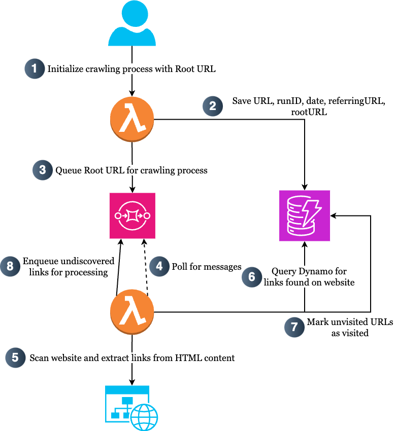

# Serverless Web Crawler – Link Identifier

**Duration:** May 2024 – Jun. 2024  
**Technologies:** AWS, Python

## Overview

This project implements a scalable, serverless web crawler using AWS services. The system automatically crawls web pages, identifies key links, and stores metadata for further analysis. It is optimized for high concurrency and minimal operational overhead.

## Architecture

The application leverages the following AWS components:

- **AWS Lambda:** Handles event-driven processing for web crawling tasks.
- **Amazon DynamoDB:** Serves as a NoSQL storage solution for metadata.
- **Amazon SQS (Simple Queue Service):** Manages distributed message handling to ensure reliable processing.



## Features

- **Automatic Crawling:** Initiates web crawling based on predefined triggers.
- **Link Identification:** Extracts and identifies key links from web pages.
- **Metadata Storage:** Stores extracted metadata, including URLs, `runID`, dates, and referring URLs, in DynamoDB.
- **Scalability:** Designed to handle high concurrency with minimal operational overhead.

## Project Structure

- **`lambda/`**: Contains AWS Lambda function code.
- **`serverless_web_crawler/`**: Core application logic.
- **`tests/`**: Unit and integration tests.
- **`app.py`**: Entry point for the AWS CDK application.
- **`cdk.json`**: Configuration file for the CDK toolkit.
- **`requirements.txt`**: Python dependencies.
- **`README.md`**: Project documentation.

## Getting Started

### Prerequisites

- **Python 3.x**: Ensure Python is installed on your system.
- **AWS Account**: Required to deploy AWS resources.
- **AWS CLI**: For managing AWS services from the command line.
- **AWS CDK**: To define cloud infrastructure using code.

### Installation

1. **Clone the Repository:**

   ```bash
   git clone https://github.com/dyuk01/serverless_web_crawler.git
   cd serverless_web_crawler

2. **Set Up Virtual Environment**

    ```python3
    -m venv .venv
    source .venv/bin/activate  # On Windows, use .venv\Scripts\activate

3. **Install Dependencies**

    ```bash
    pip install -r requirements.txt

4. **Deploy the Application:**

    ```bash
    cdk deploy

## Usage
After deployment, the web crawler will automatically start processing based on the defined triggers. You can monitor the progress and view the stored metadata in the DynamoDB table created during deployment.

## Testing
To run the tests:
```bash
pytest
```

## Acknowledgements
- [beabetterdevv](https://github.com/beabetterdevv/ServerlessWebCrawler)


